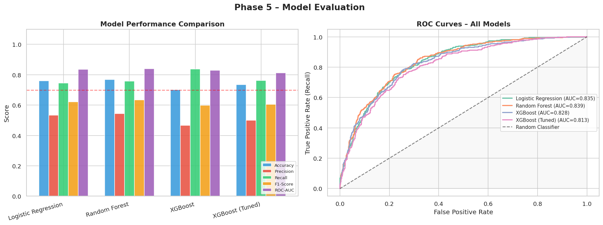
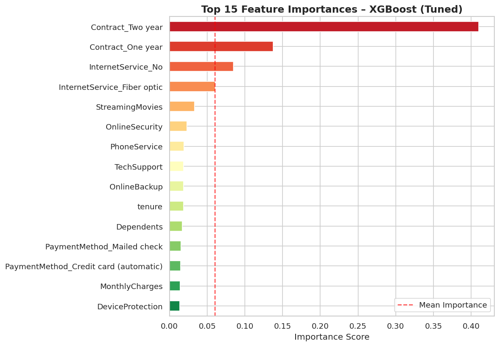
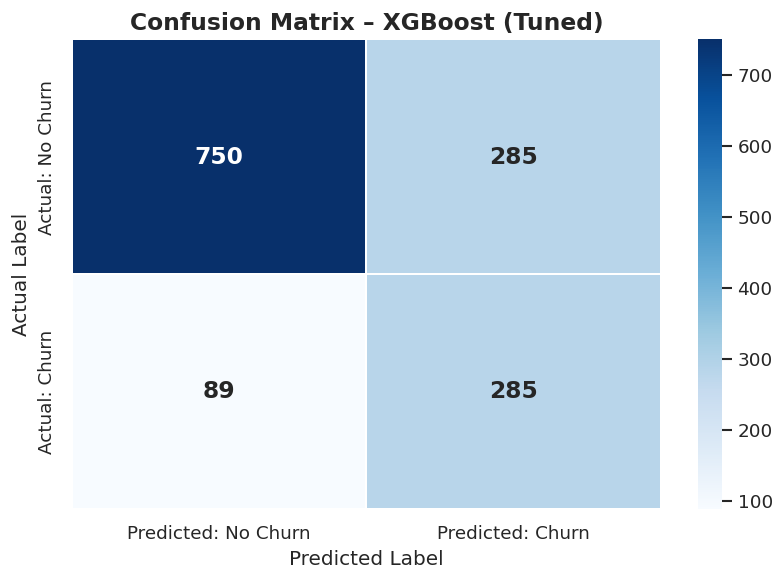

# Customer Churn Prediction Pipeline


## Business Context

Telecom companies lose between 15% and 25% of their customer base every year to churn. Reacquiring a lost customer costs 5 to 7 times more than retaining one. This project builds a machine learning pipeline that identifies customers likely to cancel **before they do**, with a recall of **84%** on the minority class.

The model integrates with any CRM or customer success platform via a REST API. A retention team can query it in real time, receive a risk score and a short list of the top contributing factors, and act before the customer churns.

## Results at a Glance

| Model | ROC-AUC | Recall (Churn) | F1 (Churn) |
|---|---|---|---|
| Logistic Regression | 0.835 | 0.74 | 0.62 |
| Random Forest | 0.839 | 0.75 | 0.64 |
| XGBoost | 0.828 | 0.84 | 0.60 |
| **XGBoost (Tuned)** | **0.813** | **0.84** | **0.61** |

XGBoost with SMOTE oversampling was selected as the final model. Recall was prioritised over precision: in a churn context, missing a churner (false negative) is more costly than a false alarm.

### Model Comparison



### Top Feature Importances



Contract type dominates the model. Customers on month-to-month contracts are significantly more likely to churn than those on annual or two-year agreements. Tenure and internet service type are the next strongest signals.

### Confusion Matrix



## Project Architecture

The project follows the CRISP-DM methodology across four components:

1. **EDA** (`notebooks/01_exploratory_data_analysis.ipynb`): Distribution analysis, categorical breakdowns, correlation heatmap and key findings summary.
2. **Modelling** (`notebooks/02_modelling_and_evaluation.ipynb`): Class imbalance strategies (SMOTE vs `scale_pos_weight`), model comparison, SHAP global and local interpretability, and quantified business recommendations.
3. **Training Script** (`src/train.py`): Standalone, CLI-driven script that reproduces the full pipeline and saves model artefacts to `models/`.
4. **Inference API** (`api/main.py`): FastAPI service that loads the trained model and serves real-time predictions with risk level and top contributing factors.

## Repository Structure

```
├── api/
│   └── main.py                       # FastAPI inference service
├── data/
│   └── Telco-Customer-Churn.csv      # IBM Telco dataset
├── docs/
│   └── images/                       # Charts used in this README
├── notebooks/
│   ├── 01_exploratory_data_analysis.ipynb
│   └── 02_modelling_and_evaluation.ipynb
├── src/
│   └── train.py                      # Standalone training script
├── tests/
│   ├── test_api.py
│   └── test_preprocessing.py
├── requirements.txt
└── README.md
```

## Quick Start

```bash
# 1. Install dependencies
pip install -r requirements.txt

# 2. Train the model and save artefacts to models/
python src/train.py

# 3. Start the inference API
uvicorn api.main:app --reload
# Swagger UI available at http://127.0.0.1:8000/docs

# 4. Run tests
pytest tests/
```

## API Usage

```bash
curl -X POST http://127.0.0.1:8000/predict \
  -H "Content-Type: application/json" \
  -d '{
    "gender": "Male", "SeniorCitizen": 0, "Partner": "Yes",
    "Dependents": "No", "tenure": 6, "PhoneService": "Yes",
    "MultipleLines": "No", "InternetService": "Fiber optic",
    "OnlineSecurity": "No", "OnlineBackup": "Yes",
    "DeviceProtection": "No", "TechSupport": "No",
    "StreamingTV": "Yes", "StreamingMovies": "No",
    "Contract": "Month-to-month", "PaperlessBilling": "Yes",
    "PaymentMethod": "Electronic check",
    "MonthlyCharges": 75.50, "TotalCharges": 453.0
  }'
```

**Response:**
```json
{
  "churn_probability": 0.7812,
  "churn_prediction": true,
  "risk_level": "High",
  "top_risk_factors": [
    "Month-to-month contract (highest churn risk)",
    "Low tenure (6 months)",
    "Fiber optic service (higher churn rate)"
  ]
}
```

## Tech Stack

| Layer | Tools |
|---|---|
| Data Processing | Pandas, NumPy, Scikit-learn, Imbalanced-learn |
| Modelling | XGBoost, Scikit-learn |
| Interpretability | SHAP |
| API | FastAPI, Uvicorn, Pydantic |
| Testing | Pytest |

## Dataset

IBM Telco Customer Churn dataset. 7,043 customers, 20 features, 26.5% churn rate.
